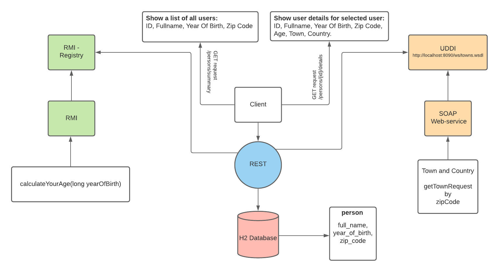
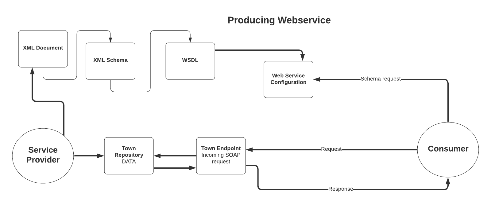
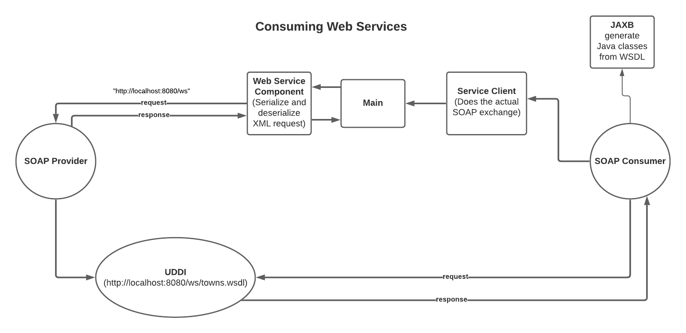

# System Integration Mini Project Web Services
### SOFT2020FALL-SI-GroupProject1
**[Assignment Link](https://datsoftlyngby.github.io/soft2020fall/resources/473f0f56-MP1-WS.pdf)**  
***
#### Author's details
_**Jörg Oertel & Morten Feldt (Team 8)**_
***
#### Web Services Used
* RMI
* SOAP
* REST
***
#### Brief Summary
This project system regards a person service, which have basic person information stored in DB like **full name**, **year of birth** and **zip code**.
These person information is getting by a **RESTful service**.   
When make a GET request for details, this service will call an **RMI Registry** to calculate age of person based on year of birth and a **SOAP web service** to get the town and country for the giving person zip code.
***
#### Installation instructions
1. Clone GitHub project
2. Run **WebServicesApplication** in module **SOAP Provider** in package **dk.si.webservices**  
3. Run **WebserviceApplication** in module **REST-RMI-SOAP [webservice]** in package **dk.si.groupproject1.webservice**
4. Run **Registry** in module **REST-RMI-SOAP [webservice]** in package **dk.si.groupproject1.webservice**  

_If you have problems with missing files in SOAP then run **compile in Maven** to create Java files_
***
#### User instructions
##### UI
1. Go to http://localhost:8080/  
2. Click on person-row in table
3. See details in a table below for the clicked person
##### REST
1. GET http://localhost:8080/persons/2/summary
2. GET http://localhost:8080/persons/2/details (NOTICE, that details give you **age**, **town** and **country** for the person with the given id)
3. POST http://localhost:8080/persons/  
**Header**  
Content-Type | application/json  
**Body**  
{  
    "fullName": "Morten FeldtTEST-3",  
    "yearOfBirth": 1984,  
    "zipCode": 2500  
}  
4. PUT http://localhost:8080/persons/2  
**Header**  
Content-Type | application/json  
**Body**  
{  
    "fullName": "Morten FeldtTEST",  
    "yearOfBirth": 1984,  
    "zipCode": 2500  
}
5. DELETE http://localhost:8080/persons/2  

##### SOAP Consuming  
Run **WebServicesApplication** in module **SOAP Consumer [webservices (1)]** in package **dk.si.webservices**
***
## Web Services Project Buisness Structure

*** 
## SOAP Provider Structure

***
## SOAP Client Structure

***

